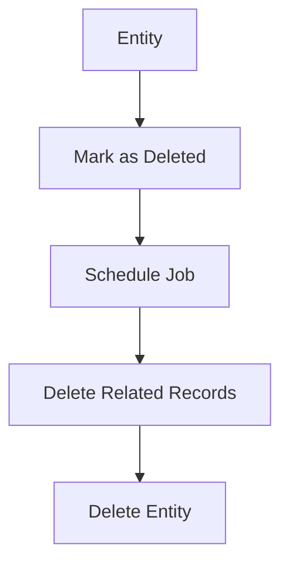

# Frank.CSharp1BR
A novel and experimental way to solve the 1 Billion Rows challange. This is quick and efficient at all, its just a fun way to do it.

## The challange

The challange is to read a 1 Billion rows file and count the number of rows that have the word "Frank" in it. The file is a CSV file with 2 columns, the first one is a number and the second one is a string. The string can have any value, but the number is a sequence from 1 to 1 Billion.

## The solution

An overly complicated solution that uses Channels, with a goal to suppert N number of lines, without using too much memory. The solution is not the fastest, but it is fast enough to be a good solution, if lets say, you have a logging og telemetry system that needs to process a lot of data, and you want to do it in a way that does not use too much memory.

### Code Design

````mermaid
flowchart LR
    RawXML[Raw XML] --> XmlBinaryClassifier[Is a document]
    XmlBinaryClassifier -- no --> AttachmentStore[(Attachment Store)]
    
    XmlBinaryClassifier -- yes --> DocumentTypeClassifier[Document Type]

    DocumentTypeClassifier -- PEPPOL --> UblDocumentExtractor[Ubl Extractor] --> UBLClassifier

    DocumentTypeClassifier -- UBL --> UBLClassifier[UBL Classifier]
    
    DocumentTypeClassifier -- EDIFACT --> EDIFACTClassifier[EDIFACT Classifier]
    
    
    UBLClassifier -- Invoice --> UBLInvoiceMapper[UBL Invoice mapper] -- DocFlow Invoice --> DocFlowInvoiceStore[(DocFlow Invoice Store)]
    UBLClassifier -- CreditNote --> UBLCreditNoteMapper[UBL Credit Note mapper] -- DocFlow Invoice --> DocFlowInvoiceStore[(DocFlow Invoice Store)]
    UBLClassifier -- Reminder --> UBLReminderMapper[UBL Reminder mapper] -- DocFlow Invoice --> DocFlowInvoiceStore[(DocFlow Invoice Store)]
    UBLClassifier -- DebitNote --> UBLDebitNoteMapper[UBL Debit Note mapper] -- DocFlow Invoice --> DocFlowInvoiceStore[(DocFlow Invoice Store)]
    
    
    EDIFACTClassifier -- Invoice --> EDIFACTInvoiceMapper[EDIFACT Invoice mapper] -- DocFlow Invoice --> DocFlowInvoiceStore[(DocFlow Invoice Store)]
    EDIFACTClassifier -- CreditNote --> EDIFACTCreditNoteMapper[EDIFACT Credit Note mapper] -- DocFlow Invoice --> DocFlowInvoiceStore[(DocFlow Invoice Store)]
    EDIFACTClassifier -- Reminder --> EDIFACTReminderMapper[EDIFACT Reminder mapper] -- DocFlow Invoice --> DocFlowInvoiceStore[(DocFlow Invoice Store)]
    EDIFACTClassifier -- DebitNote --> EDIFACTDebitNoteMapper[EDIFACT Debit Note mapper] -- DocFlow Invoice --> DocFlowInvoiceStore[(DocFlow Invoice Store)]
````

## The Deletion Process

The deletion process is a bit tricky. The following steps are taken:

1. The entity is marked as deleted in the database (the `IsDeleted` flag is set to `true` or similar)
2. A scheculed job runs and a delete records that are soft deleted and are older than a certain amount of time (e.g. 7 days)
3. The job deletes or nullifies any related records that would otherwise be orphaned or cause a foreign key constraint violation
4. The job deletes the entity from the database



